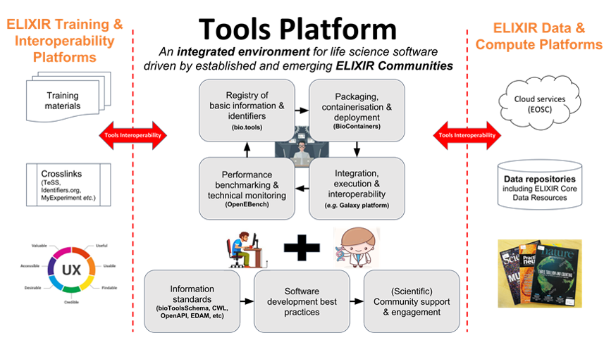
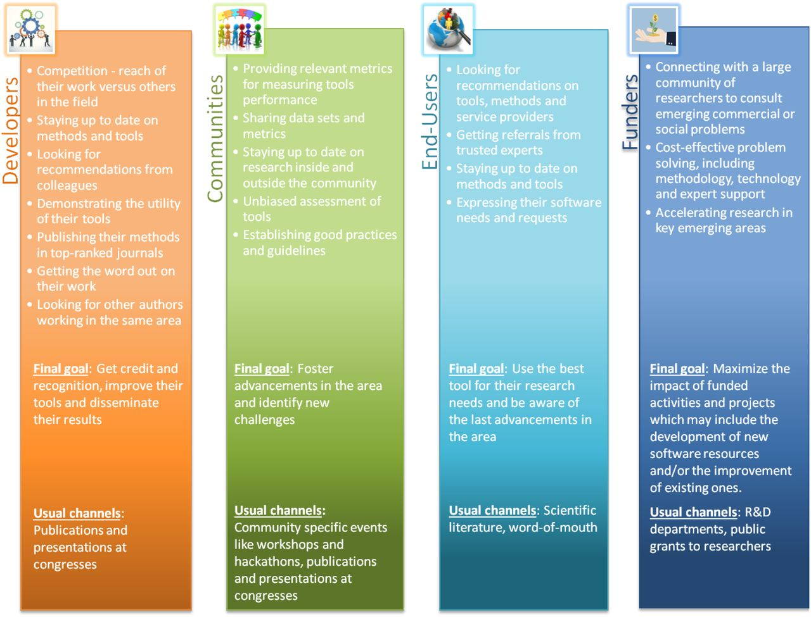

# Introduction to benchmarking

Why benchmarking in bioinformatics?
-----------------------------------

Benchmarking consists of measuring the performance of some physical
process under the same conditions by using specific indicators that
depend on the field, resulting in one or more values that are then
compared to others. Nowadays, it is used in almost every field, from
business and finances to industry and computation. In computation,
benchmarking can be performed from a technical, functional and/or
scientific perspective. The more aspects are considered (e.g. technical,
scientific, functional) when comparing software, the better the
evaluation of the software being compared.

It is well known among the science community that bioinformatics is an
important emerging field. There has been a huge explosion in the amount
of health and biological data during the last 20 years, and also in the
amount of software available: there is an urgent need of computational
methods, tools and databases in order to store, manage and extract
meaningful knowledge from that data.

In other words, the dependence of life scientists on software has
steadily grown in recent years: researchers at public institutions and
private enterprises all over the world are constantly developing new
computational resources and improving the existing ones to make life
sciences research more accurate, quicker and efficient. Thus, it is not
surprising that benchmarking has become an essential process within the
bioinformatics field; for many tasks, researchers have to decide which
of the available bioinformatics software are more suitable for their
specific needs and, if possible select the one that provides the highest
accuracy, the best efficiency and the highest level of reproducibility
when integrated in their research projects and/or daily practice. This
is nowadays widely utilized to analyze the efficiency of several
algorithms and/or workflows used for various purposes such as sequence
alignment, protein structure or/and orthology prediction among others.

Benchmarking Perspectives
-------------------------

In bioinformatics, benchmarking activities can be considered from three
perspectives; the technical, the scientific and the functional ones:

-   **Technical benchmarking** usually focuses on technical quality
     metrics, such as, for instance, whether it can be compiled with no
     errors, resources needed along the execution (storage, memory),
     the reproducibility of the results, and portability, among others.
     In the case of services, relevant features are accessibility,
     up-time, communication protocols, response time, processing speed,
     and interoperability.

-   **Scientific benchmarking**, on the other hand, determines the
     performance of bioinformatics resources in the context of
     predefined reference datasets and metrics reflecting specific
     scientific challenges. Some metrics relate to experimental
     readouts used as standards of truth while others merely quantify
     some level of optimization. Those metrics allow to objectively
     evaluate the relative scientific performance of the different
     participating tools and, what is more, with a deep scientific
     knowledge and substantial information about the corresponding
     tools it is even possible to understand what are the tools
     potential biases, strengths and weaknesses or under which
     conditions do tools underperform. What is more, benchmarking can
     also provide quality control for new resources or releases of
     established resources; often, developers present a new tool and,
     once it is challenged in a benchmarking event, they decide not
     make their results publicly available, presumably after
     discovering poor outcome in some of the benchmarks. This clearly
     demonstrates the effectiveness of a community benchmarking service
     for quality control.

-   **Functional benchmarking** performs a user-based evaluation of
     software usability. Some relevant aspects that determine the
     usability of a given software are: how intuitive and easy-to-use
     is the interface; if there exists clear and comprehensive user
     documentation; whether software customizes the user experience
     according to predefined roles when more than one profile is
     available; whether it is linked to data repositories that are
     updated frequently; if there are communities around the software
     aiming to support users and/or developers; whether the software is
     open source and licenses are properly indicated.

OpenEBench: the ELIXIR platform for benchmarking
------------------------------------------------

All these efforts conform to a highly diverse scenario that helps all
kinds of bioinformaticians, developers and researchers to test their
tools and choose the best fitting resource for their scientific needs.
However, due to the increasing amount of resources and communities,
large-scale efforts for developing, maintaining and extending
centralized infrastructures which support those community efforts are
essential in the context of ELIXIR, which embraces those required
platforms in order to secure standardization, guarantee
interoperability, preserve reference data sets and strive to minimize
the impact of budget and manpower constraints at a European level.

ELIXIR is an intergovernmental organization that brings together life
science resources from across Europe
[https://www.elixir-europe.org](https://www.elixir-europe.org). These resources include
databases, software tools, training materials, cloud storage and
supercomputers.

The goal of ELIXIR is to coordinate these resources so that they form a
single infrastructure that makes it easier for scientists to find and
share data, exchange expertise, and agree on best practices and,
ultimately, help them gain new insights into how living organisms work.

More concretely in benchmarking, there is a clear need of establishing
standards, relevant scientific challenges and meaningful metrics by
knowledgeable scientific communities. However, those efforts should be
complemented by a stable platform which can support these activities,
provide a reference place for different stakeholders and give a general
overview on how tools and workflows, scientific challenges, metrics and
data sets evolve over time.

[OpenEBench](https://openebench.bsc.es) is the ELIXIR
benchmarking and technical monitoring platform for bioinformatics tools,
web servers and workflows. OpenEBench is part of the ELIXIR Tools
platform and its development is led by the Barcelona Supercomputing
Center (BSC) in collaboration with partners within ELIXIR and beyond.

Within the ELIXIR project, OpenEBench is being developed under [the Tools
Platform at the Work Package 2 (WP2: Benchmarking)](https://elixir-europe.org/platforms/tools). The focus of
this WP is on:

-   Assessing bioinformatics methods in terms of quantitative
     performance and user friendliness. Organize and support relations
     to biology and medicine communities already running benchmarking
     exercises.

-   Develop and maintain a generic infrastructure for benchmarking
     exercises in different subareas.

-   Develop the technology to perform online, uninterrupted methods
     assessment in key areas of bioinformatics.

-   Develop and implement data warehouse infrastructures to store
     benchmarking results and make them accessible to developers and
     end-users for subsequent transfer to other ELIXIR and non-ELIXIR
     platforms e.g. ELIXIR registry bio.tools.

-   Develop the procedures to create standards for benchmarking in
     different areas.

All OpenEBench components have been designed and implemented following
the recommendations made by the ELIXIR tools platform e.g. making code
available in public repositories from day 1; are available as software
containers, and use workflow managers promoted by ELIXIR. Next figure
illustrates the interconnection of OpenEBench to other ELIXIR tools
platforms systems and platforms and beyond.

Hence, OpenEBench is a platform designed to establish a continuous
automated benchmarking system for bioinformatics methods, tools and web
services. This infrastructure implements a system for storing and
sharing benchmarking results and allows to perform benchmarking
experiments. It scales according to the number of participants and
allows centralized collaborative efforts to define reference data sets.

This framework will optimally integrate the decision-making capabilities
of communities and involved groups. In order to engage and keep the
interaction among community members, it is important to have a website
which provides both friendly and unified programmatic access across
different resources at the benchmarking platform. This central access
point will facilitate data exchange, and promote results dissemination.
Thanks to the use of various APIs (Application Programming interfaces)
for the creation and deployment of web services, content sharing between
this central access point and external providers (i.e. communities and
software registries) is facilitated, allowing OpenEBench users to
conduct continuous automated benchmarking tests online.

In summary, the goals of OpenEBench are to:

-   Provide guidance and software infrastructure for Benchmarking and
     Technical monitoring of bioinformatics tools.

-   Engage with existing benchmark initiatives making different
     communities aware of the platform.

-   Maintain a data warehouse infrastructure to keep record of
     Benchmarking initiatives.

-   Expose benchmarking and technical monitoring results to other ELIXIR
     and non-ELIXIR resources.

-   Establish and refine communication protocols with communities and/or
     infrastructure projects willing to have a unified benchmark
     infrastructure Coordinate with ELIXIR.

-   Work with the ELIXIR Interoperability Platform to keep FAIR data
     principles on the Benchmarking data warehouse.

Thanks to this principles, OpenEBench will offer support to Developers,
Communities, End-Users and Funders:

-   Developers will be able to reach their work and compare their tools
     with others, which will demonstrate their utility and, ultimately,
     help to improve their methods and disseminate their results thanks
     to publications and results spreading.

-   Communities will foster advances and identify new challenges/issues
     in their concrete area by providing assessment metrics,
     contributing to results dissemination and establishing good
     practices.

-   End-users will mainly benefit, as we explained before, from getting
     guidance about choosing the best tool for their research needs and
     be aware of the latest advancements in the area by getting
     information from trusted experts and staying up to date with
     methods and tools.

-   Funders will be able to maximize benefits in projects which include
     the development of new software resources and/or improve the
     existing ones.

