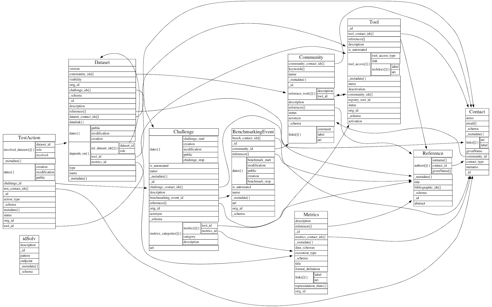

# **Level 1**

Level 1 is used for the long-term storage of benchmarking events and
challenges aiming at reproducibility and provenance. It allows users to
share and visualize benchmarking results within the community or make
them publicly available so that any user can consume them.

This level is tightly related with the OpenEBench Benchmarking Data
Model. The Benchmarking Data Model defines the structure of a whole
benchmarking process that takes place in OpenEBench. It uses [JSON
Schemas](https://json-schema.org/), based on JSON Schema
Draft 04 standard, to validate the objects that are used in the
different communities benchmarking services.

Another interesting feature of OpenEBench related to this level are the
results visualization modes. Raw data from Level 1 (e.g. tables or JSON
files with numeric metrics) might be difficult to understand for
non-expert users; thus, at OEB we offer a gallery of benchmarking
results widgets that allow users to visualize and interpret complicated
metrics.

## Benchmarking Data Model 

In an effort to standardize the benchmarking process per se, we have
developed a refined data-model to reflect the process itself and allow
scientists to refer to a particular step and/or data set in a defined
way.

OpenEBench Benchmarking Data Model defines the structure of a whole
benchmarking process that takes place in the platform. It uses [JSON
Schemas](https://json-schema.org/), based on JSON Schema
Draft 04 standard, to validate the objects that are used in the
different communities benchmarking services.

Those objects structured to model the elements that come into play in a
benchmarking service; and they also have properties/keys that are used
to set the values for a particular community and results, or to connect
objects between each other.

The schemas that are currently considered in the model (version 1.0) can be found in our data model's [repository](https://github.com/inab/benchmarking-data-model/tree/master/json-schemas/1.0.x). Here is a short description about each of them:

-   **Community**: The description of a benchmarking community, like CASP, CAFA, Quest for Orthologs, etc...

-   **Contact**: A reference contact of a community, tool, metrics or any other object.

-   **Reference**: A bibliographic reference, used to document a community, a contact, a tool, a dataset, a benchmarking event or metrics.
-   **Tool**: Software which can be used in the lifecycle of one or more benchmarking communities. Can be a participant in a particular benchmarking challenge, or software used to perform the benchmark itself.

-   **Metrics**: Defined metrics which can be computed from a dataset. Could be, for instance, the numerical values indicating some tools performance.

-   **Dataset**: Any one of the datasets involved in the benchmarking events lifecycle. So, they can be interrelated (for data provenance) and cross-referenced from the other concepts. There are 7 types of datasets defined in the model, which correspond to the specific data used in the different steps of a benchmarking event (e.g. metrics_reference, participant...) They are further explained in the data types section.

-   **BenchmarkingEvent**: A benchmarking event is defined as a set of challenges coordinated by a community, either attended or unattended.

-   **Challenge**: A challenge is the evaluation strategy defined by the community. It can be defined by a set of one or more metrics, reference datasets and test actions, related to the participants involved in the challenge.

-   **TestAction**: The involvement of a tool in a challenge, taking as input the datasets defined for the challenge, and generating the result datasets in the format agreed by the community. The generated datasets are later related to metrics datasets, which are the metrics agreed by the community for the challenge, used later to assess the quality of the result.

-   **idSolv**: This side concept is used to model [CURIE's](https://en.wikipedia.org/wiki/CURIE) which are not yet registered in [identifiers.org](https://identifiers.org).

Sample JSON files can be validated against these schemas using scripts located in [extended JSON Schema validators](https://github.com/inab/extended-json-schema-validators) repository or the online tool [JSON Schema Validator](http://www.jsonschemavalidator.net/).

Find more about the benchmarking data model in our Github repository (https://github.com/inab/benchmarking-data-model).

### Datasets: types and cross-references

OpenEBench data types are defined in the data model, within the
'Dataset' schema. These types correspond to the different types of
datasets that are used during the lifecycle of a benchmarking event.
There are 7 types of datasets defined in the data model:

-   **Public Reference data sets**. They are a widespread, publicly available and well characterized data set which can be used by developers and/or interested users to gather performance data of their systems in a controlled set-up. Scientific communities tend to make available Public Reference data to facilitate the engagement of participants within the challenges at hand. These data sets could comprise data from previous benchmarking editions but it is highly dependent on the community and the scientific problem at hand.

-   **Input data sets**. Represent the data sets to be processed as input by participants in the benchmarking activities. Those data sets can be publicly available for download at specific repositories e.g. UniProtKB specific reference proteome sets for the Quest for Orthologs participants; and/or can be submitted automatically by benchmarking platform e.g. CAMEO, to participants web-servers. Input data sets should follow at least the same data formats as the Public Reference data sets, and should provide enough metadata describing the data sets to facilitate reproducibility, data provenance and, potentially, the evolution of participants across different benchmarking challenges editions with different input data sets of varying degrees of complexity.

-   **Participant data sets**. These data sets represent the data e.g. predictions, produced by participants given a specific Input data set associated to specific benchmarking activities. Depending on the level of automation, participant data sets can be submitted manually e.g. uploaded to a server, and/or automatically e.g. response via APIs implemented in systems like BeCalm. Unless previously agreed, participant data sets are often kept private to participants and/or communities. It would be recommendable that participant data sets which are part of scientific benchmarking publications should be made available for reproducibility purposes, data reuse in downstream analysis and/or further meta-analysis.

-   **Metrics Reference data sets**. These data sets contain data used to evaluate the benchmarking process, i.e. the "true" responses to the challenges. These data sets are often kept private by benchmarking events organizers while a challenge is active. This standard practice prevents participants from adjusting their systems to have the best performance for very specific data sets, which is often referred to as overfitting. Overfitting may render systems useless and not-fit-to-purpose and, therefore, it is highly discouraged. Depending on the nature of the Metrics Reference data sets, those can be either "Gold data sets" or "Silver data sets". It is not uncommon to have both types of data sets as part of a Benchmarking event. When available, Golden data is desirable because it represents the ultimate data that any system should aim to produce. For instance, in the case of Protein Structure Predictions the experimental data deposited in the Protein Data Bank (PDB) is considered to be the "Gold data" for the benchmarking activities carried out by communities such as CAMEO, CASP, and CAPRI. In the absence of a gold standard, benchmarking efforts have to resort to "Silver data". For instance, synthetic and/or simulated datasets generated in silico following previous experiences or with data generated using unsupervised learning approaches, based on the consensus among different ---i.e. algorithmically independent --- methods. For the latter, naive methods e.g. Bayesian networks, can provide a baseline allowing assessors to measure relative performance between methods with, on average, moderate to good accuracy. Such consensus data is referred to as "Silver data". However, data from silver standards should be used with caution as it needs to be revised regularly to adequately evaluate new developments in the field. Often Metrics Reference data sets become public e.g. Public Reference data sets, once a given challenge has concluded because of its intrinsic value to address valuable scientific challenges.

-   **Assessment data sets**. These data sets are produced after applying specific metrics e.g. True Positive Rate, to participants data sets while considering metrics reference data sets. Assessment data sets establish how close or far are participants from the expected results. Often preliminary assessment data sets tend to be private to each participant e.g. understanding the initial characteristics of the platforms and/or metrics reference data sets nature; while final assessment data sets tend to be shared among benchmarking participants before the challenge ends, and made public once the events end. Even when participant data sets are not available, assessment data sets can be very useful to measure the performance evolution of different systems versions for the same challenge and/or the complexity of different reference metrics data sets for the same system. Ideally, assessment data sets would allow to track the evolution of both reference metrics data sets and systems versions. However, it would be nearly impossible to deconvolute the impact of each variable into the final results.

-   **Aggregation data sets**. These data sets are considered metadata sets grouping either i) assessment data sets from different participants for the same reference metrics data set and applied metrics, ii) assessment data sets from the same participant but for different reference metrics data sets and/or applied metrics in the same benchmarking event, or iii) the grouping of the assessment data sets from the same participant and the same applied metrics across different benchmarking events. Aggregation data sets are the foundations of the community-led scientific benchmarking activities as they offer an unified framework to compare participants performance among themselves for a specific scientific challenge and/or the evolution of individual participants along time. Aggregation data sets allow data bundling and are the ones consumed by experts and non-experts for taking decisions on what systems to use for their own scientific problems. Aggregation data sets can be directly offered at OpenEBench using available views e.g. experts and non-experts data views; and/or using available APIs. Those data sets due to their own nature would be mostly public although they might remain private to scientific communities and/or benchmarking participants while challenges remain open.

All those types are used in the different steps of a benchmarking
experiment, so they can be interrelated (for data provenance) and
cross-referenced from the other concepts (e.g. MetricsEvent defines the
step from a participant dataset to an assessment dataset). The following
figure illustrates how the different dataset are connected through
TestActions.

TestActions can have very different roles. The role is determined by the
action type:

-   **TestEvent** defines the transition from an input dataset to a participant dataset. In the benchmarking cycle it corresponds to the process when the participant makes its predictions.

-   **MetricsEvent** defines the transition from a participant dataset to an assessment dataset. In the benchmarking cycle, it corresponds to the evaluation of the participant's submission, that is, the computation of the metrics.

-   **AggregationEvent** defines the transition from one or more assessment dataset into a single aggregation dataset. In the benchmarking cycle, it corresponds to the consolidation of the benchmark, when - usually the community manager - brings together the results from all the participants and prepares them for visualization.

### Datasets: Accessibility

Despite the nature of each data set, it is crucial that all data sets
which are part of community-led scientific benchmarking efforts become
public during their data life cycle. This effort will incentive open
discussions and decisions within the community around which scientific
challenges are relevant. Moreover, those efforts can be re-used by other
communities and maximizing the data added value. Here, only assessment
data sets can be published along with the assessment workflow, making
sure that the original data cannot be reconstructed, e.g. for very small
datasets. As a general rule, data should follow the FAIR data principles
(Wilkinson et al. 2016), which states how to make data Findable,
Accessible, Interoperable and Re-usable. This is part of a general
movement in favor of implementing the principles around Open Science,
Open Data and Open Source.

When defining reference data sets the data ownership is an important
aspect. In order to avoid systems overfitting, communities might decide
to conduct specific experiments to generate Input and/or Metrics
Reference data sets, which are used for specific benchmarking events. In
those circumstances and until data is publicly released e.g. via a
scientific publication, data is private to the organizers and
benchmarking participants should honor that. Thus, a legal mechanism to
regulate data ownership and use is highly relevant. Specifically,
participants should accept a legal binding agreement which prevents them
to use accessed data for purposes different to participating in the
benchmarking activities at hand. ~~CAMI (Critical Assessment of
Metagenome Interpretation) already implements such policy to guarantee
that participants honor such agreement. However, their system cannot
change the status easily, given that there is a manual validation of
scanned documents step before participants gain access to data.~~

Another important aspect for supporting benchmarking activities carried
out for scientific communities is how data is accessed and shared
through OpenEBench and associated APIs. As stated before, data should be
made publicly through the data life cycle unless ethical and/or legal
aspects prevent that. However, the system should be flexible enough to
offer scientific community members, organizers and participants control
over how data is accessed and distributed at any point in time. Thus, we
propose four different data accessibility models in OpenEBench:

-   **Private**. This is the most restrictive accessibility model in OpenEBench. In this mode, only the data owner have access to this data as well as the data derived from it, e.g. Assessment data obtained when processing participants data. This accessibility model will facilitate participants to compare themselves with already existing data in a specific Benchmarking event, and might be useful at the initial stages of benchmarking challenges when it is needed to make sure that submitted data is behaving as expected.

-   **Restricted**. This accessibility model allows users to share data sets using URLs. This is a very convenient mechanism to foster collaborations among developers of distributed systems as well as to communicate results with restricted audiences e.g. among peers when a scientific manuscript is submitted.

-   **Community based**. This is the default accessibility model when a Benchmarking event is on-going. This model allows participants to share and/or compare their system performance, e.g. Assessment and/or Challenge data sets, on real time among community members. This will facilitate open and transparent discussions among community members and it can also facilitate the detection of potential flaws in the setting up of the ongoing event.

-   **Public**. This is the default accessibility model for already closed Benchmarking events. This visibility mode allows different stakeholders to have access to data e.g. Assessment and/or Aggregation data sets, and data transformations associated to them, for instance transitions between experts and non-experts views applying different classification algorithms. Making publicly available data is not constrained to finalized Benchmarking events because participants and/or events organizers can make data under their responsibility public. Importantly, once a data set is made public, it should be maintained as such to avoid potential confusion across stakeholders.

Independently of the visibility mode, data should follow the FAIR
principles e.g. use of persistent and unique identifiers, because it
should be possible to change the visibility mode among available ones
e.g. private data could be made available to a whole community;
restricted access data can be made publicly available, etc. Moreover,
data should be interoperable at any time in and outside OpenEBench to
facilitate their access, secondary analysis and/or further re-use by
communities running scientific benchmarking activities. OpenEBench will
work closely with the ELIXIR Data Platform to identify the most suitable
long-term data repositories for data generated at the platform.

## OpenEBench APIs

OpenEBench platform aims to be a central platform not only to generate,
but to publish and distribute benchmarking data across the scientific
community. To this end, a set of microservices are publicly offered as
REST APIs to retrieve data from the major OpenEBench repositories.

| Data Retrieval APIs           |                     URL                        | Source code | 
|-------------------------------|-----------------------------------------------------|-------------|
| OpenEBench Tools Monitoring   | [endpoint](https://openebench.bsc.es/monitor/)                  | [https://gitlab.bsc.es/inb/elixir/tools-platform/elixibilitas](https://gitlab.bsc.es/inb/elixir/tools-platform/elixibilitas)        |
| OpenEBench Scientific Upload  | [endpoint](https://openebench.bsc.es/api/scientific/submission/)| [https://gitlab.bsc.es/inb/elixir/openebench/openebench-submission-api](https://gitlab.bsc.es/inb/elixir/openebench/openebench-submission-api)        |        
| OpenEBench Scientific Retrieve|  [endpoint](https://openebench.bsc.es/sciapi/ )                  | Inab repo        | 

Those API's access OpenEBench MongoDBs instances (v4.2.5) and allow
users to query for the results they are interested in. Access to
OpenEBench is generally authenticated (although anonymous users can be
created). In those conditions data and tools access can be restricted as
required. OpenEBench will not provide data access credentials. Instead,
we will honor the agreements between data users and providers.

## Data Upload

OpenEBench Community Managers can upload the results from their full
benchmarking event to the platform by using one of the scientific APIs
(https://openebench.bsc.es/api/scientific/submission/) . In
order to do that they have to:

1.  Covert their full experiment to the official [Benchmarking Data Model](#benchmarking-data-model) - datasets, tools, challenges... Please contact the OpenEBench team if you need any help in adapting your benchmarking process to the data model concepts.

2.  Validate the full set of generated JSON objects against the official [Benchmarking Data Model](#benchmarking-data-model) using this [JSON Schema validator](https://github.com/inab/extended-json-schema-validators).

3.  Register the community and manager contact (if not already done) - now this is done by OEB managers with the community and main contact objects. New managers will be assigned an username and password.

4.  Merge the set of JSON objects into a single array. In Linux systems, executing the following command in the root directory that contains all files does the trick : `jq -s . $(find . -type f -name "*.json") > your_file_name.json` (jq library needs to be installed).

5.  Upload the array of JSON objects to the temporary database (using the assigned username and password) with the following command : `curl -v -X POST -u <user>:<passwd> -H "Content-Type: application/json" https://dev-openebench.bsc.es/api/scientific/submission/?community_id=OEBC002 -d @your_file_name.json`

6.  2nd validation of data in temporary database against Benchmarking Data Model.

7.  Use the [migration tool](https://gitlab.bsc.es/inb/elixir/openebench/openebench-distiller-tool) for moving the data to production OEB Mongo DB.

8.  Data is ready to be visualized in [OpenEBench](https://dev-openebench.bsc.es/)!!

Please note that steps 6 and 7 are now performed by the OpenEBench team.

## Scientific benchmarking: visualization and interpretation of results

To increase the informativeness of benchmarking results it is important
to visualize the participants results in an appropriate context, which
is what allows to compare the performance of the evaluated resources.
However, due to the high specialization, those results change a lot from
one community to another, so understanding them is not a trivial task
for end-users, who might not have the required background knowledge.

Thus, we consider it is fundamental that, as the reference benchmarking
site within the ELIXIR project, OpenEBench must, in addition to provide
an infrastructure to bring together all the resources and communities,
offer mechanisms to facilitate the interpretation of results by experts
and non-experts users. OEB offers a gallery of visualization methods
that should be picked by the community according to the nature of their
data and prospective users. Those visualization methods allow us to
interpret and classify the benchmarking results so that they are easily
understandable by all kinds of users.

There are currently three available visualization modes in the platform:

-   **2D ScatterPlot**: chart that allows to visualize results from challenges that use two performance metrics (e.g precision vs recall) [See source code here](https://github.com/inab/OpenEBench_scientific_visualizer)

-   **BarPlot**: chart that allows to visualize results from challenges that use one performance metric (e.g F-Measure) [See source code here](https://github.com/inab/Scientific_Barplot)

-   **Benchmarking Event Summary Table**: table that summarizes the results of a multi-challenge benchmarking experiment. [See source code here](https://github.com/inab/bench_event_table)

All these visualization modes were designed as 'portable widgets'; that
is, they can be used within the OpenEBench infrastructure, or easily
plugged in another website that consumes data from OpenEBench APIs.
Usually, it is just needed [npm](https://www.npmjs.com/) to
install all the library' dependencies and [Webpack](https://webpack.js.org/) to compile the code, which
results in a 'build.js' file that can be reused in any web server.

### 2D ScatterPlot results visualization

This chart allows to visualize results from challenges that use two
performance metrics (e.g precision vs recall), and apply several
classification methods that transform them to tabular format, with a
green color scale which makes it easier to find out which are the
top-performing tools. These classification algorithms look for the
optimization of the challenge metrics in order to group the tools
according to their proximity to the 'ideal performance'.

1.  **Square quartiles** - divide the plotting area in four squares by getting the 2nd quartile of the X and Y metrics. This classification method basically splits the participants set in half by each of the metrics using the second quartile. By drawing a line over the quartile values in the plot, the area is divided in 4 groups that might not contain the same number of participants. These groups were then rated according to the performance of the participants within them; the square which overlaps with the 'optimal performance' corner is considered as the best group, followed by the one on its right/left, then the one over/under it, and finally the one in the opposite corner. However, this order may change according to the requirements of the supported community.

2.  **Diagonal quartiles** - divide the plotting area with diagonal lines by assigning a score to each participant based in the distance to the \'optimal performance\'. After normalizing the axes to the 0 - 1 range, the score is computed as the sum of the distances of each of the points to the axes; the higher that score is, the closer that participant is to the ideal performance. Linear quartiles classification was then applied to the scores dataset, obtaining three scores that group the participants in four classes - each of the groups is expected to have roughly the same number of participants. These groups were then rated according to the performance of the participants within them: the groups showing the highest score were considered as the first quartile (best performance).

3.  **Clustering** - group the participants using the K-means clustering algorithm, which groups data by trying to separate samples in n groups of equal variance, minimizing a criterion known as the inertia or within-cluster sum-of-squares. This algorithm requires the number of clusters to be specified, for consistency with the rest of the methods, it is by default set to four; however we could offer communities new visualization modes where the number of clusters can be customized. Once the algorithm converges, the groups are sorted according to the performance of the participants within them. In order to do that the clusters' centroids are considered as 'new' participants, representative of the full set of tools within a group and computed the score as we did in the diagonal quartiles method. That set of scores is then sorted to assign a ranking to each of the clusters. In order to visualize the different clusters in the plot the cluster number is shown next to each group, and a polygon is drawn grouping all the cluster' participants.

The dashed grey line corresponds to the **Pareto frontier**. The Pareto
frontier or Pareto set is the set of parameterizations (allocations)
that are all Pareto efficient; that is, the set of participants that
optimizes the system. In our particular study the frontier could be
defined as the set of participants for which you can't improve on one
metric without making the other metric worse. It can be visualized as a
line in the plot which runs over the tools showing the best efficiency
among the full set of methods.

Another interesting feature of this plot is the interactivity, the
elements of chart's legend and table are clickable so that the end-user
can hide the participants he is not interested in and/or lay far from
the area of interest; and the classification is dynamically recomputed.

For more information, visit its official Git Repository - [https://github.com/inab/OpenEBench_scientific_visualizer](https://github.com/inab/OpenEBench_scientific_visualizer)

### BarPlot results visualization

This chart allows to visualize results from challenges that use one
single performance metric (e.g F-Measure), and transform them to tabular
format, with a green color scale which makes it easier to find out which
are the top-performing tools.

In this chart each of the bars corresponds to a participant in the
challenge, while the Y-axis corresponds to the evaluation metric. The
transformation to table is achieved by sorting the participant by the
value of the metric in descending order, and then applying lineal
quartiles classification to the metrics dataset, obtaining three scores
that group the participants in four classes - each of the groups is
expected to have roughly the same number of participants. These groups
were then rated according to the performance of the participants within
them: the groups showing the highest (or lowest, depending on the
metric) values were considered as the first quartile (best performance).

For more information, visit its official Git Repository - [https://github.com/inab/Scientific_Barplot](https://github.com/inab/Scientific_Barplot)

### Benchmarking Event Summary Table

The summary table condenses the results of a whole benchmarking event in
a single table. Each of the columns corresponds to the
quartiles/clusters of applying one of the classification methods
described in the 2D ScatterPlot section, highlighted in green the
top-performing tools. This view offers the possibility to see, at a
glance, the overall results of a tool's performance across all the
benchmarking challenges in a particular event.

For more information, visit its official Git Repository - [https://github.com/inab/bench_event_table](https://github.com/inab/bench_event_table)