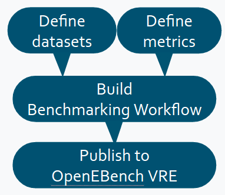
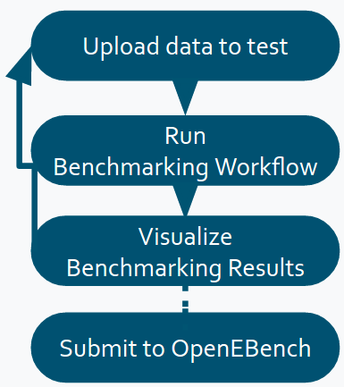
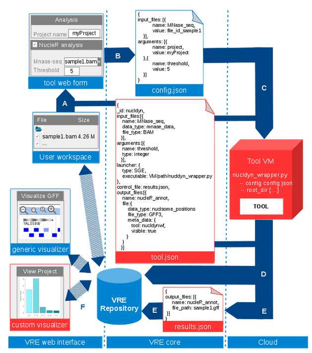

# **Level 2**

The level two architecture is built on top of level one; it allows
communities to run benchmarking experiments at OpenEBench by using
benchmarking workflows to assess participants' performance. Those
workflows compute one or more evaluation metrics given one or more
reference datasets, and produce several assessment and aggregation
datasets (see section [Benchmarking Data Model: Data Types and
Cross-References](./level_1.md)), which are compatible with Level 1, so they can be
easily exported to OpenEBench' Mongo database for long-term storage.

## Workflows structure

As seen in the Figure below, our benchmarking workflows are composed of
three conceptual blocks (that might be formed of one or more workflow
steps), which we encourage the communities to follow for compatibility
with our system. Those blocks are:

1.  **Validation and preprocessing**: the input file format is checked and, if required, the content of the file is validated (e.g check whether the submitted file contains certain fields, or compare to a 'public reference' dataset to check if the submitted IDs exist). These are the parameters involved in this step (for more information about parameters visit the 'workflow parameters' structure):

-   Inputs: input, community_id, challenges_ids, participant_id, public_ref_dir

-   Outputs: validation_result (and an exit status which indicates whether the validation was successful or not).

2.  **Metrics Computation**: the predictions are compared with the \'Gold Standards\' provided by the community, which results in one or more performance metrics (e.g. Precision & Recall). These are the parameters involved in this step (for more information about parameters visit the 'workflow parameters' structure):

-   Inputs: input (depending on whether the validation step was successful), community_id, challenges_ids, participant_id, goldstandard_dir.

-   Outputs: assessment_results.

3.  **Results Consolidation**: the benchmark itself is performed by merging the tool metrics with the rest of the community' reference data. The results are provided in JSON format and SVG format (scatter plot). These are the parameters involved in this step (for more information about parameters visit the 'workflow parameters' structure):

-   Inputs: assessment_results, validation_result, assess_dir

-   Outputs: outdir, data_model_export_dir

As seen in the Figure's green box, all three steps produce a series of
Datasets which are compatible with the Elixir Benchmarking Data
Model ([see section](./level_1.md)).

For reproducibility and interoperability purposes, OpenEBench encourages
communities managers to submit their pipelines wrapped with a workflow
management system (e.g [Nextflow](https://www.nextflow.io/)) and its tools
containerized (e.g. [Docker](https://www.docker.com/)). **NOTE for developers, in
order to make the workflow containers reproducible and stable in the
long-term, make sure to use specific versions in the container base
image (e.g.ubuntu:16.04, NOT ubuntu:latest).**

For more information about how to build your own benchmarking workflow,
see our TCGA sample workflow at
[https://github.com/inab/TCGA_benchmarking_workflow](https://github.com/inab/TCGA_benchmarking_workflow). **NOTE
for developers: In order to make your workflow compatible with the
OpenEBench infrastructure, please make sure to use the same 3-step
structure, output formats, and parameter names in it.**

## Workflow parameters

Description of the parameters used in OEB benchmarking workflows:

-   **<u>INPUTS</u>**

    -   **input**: predictions file submitted by the participants

    -   **public_ref_dir**: directory which contains one or more reference files used to validate input data.

    -   **participant_id**: name of the tool used for the predictions.

    -   **goldstandard_dir**: directory where the 'gold standard' or 'reference data' to compute the metrics are found.

    -   **challenges_ids**: list of challenges (performance evaluation methods) which are performed in the benchmark - if you have only one evaluation method, just define a name for it.

    -   **assess_dir**: directory where the performance metrics for other participants to be compared with the submitted one are found. If there is no other benchmark data yet, an empty aggregation dataset should be defined.

    -   **community_id**: name or OEB permanent ID for the benchmarking community.

-   **<u>OUTPUTS</u>**

    -   **validation_result**: file path where it is written the validated participant JSON, which corresponds to a minimal dataset compatible with the Elixir [Benchmarking Data Model](./level_1.md).

    -   **assessment_results**: file path where it is written the set of assessment datasets in JSON, which corresponds to minimal datasets compatible with the Elixir [Benchmarking Data Model](./level_1.md).

    -   **outdir**: directory where the run results are saved - one or more aggregation files used by the visualization, and several SVG/PNG plots.

    -   **statsdir**: directory where all nextflow statistics (timeline, trace, report...) are written.

    -   **data_model_export_dir**: file where all the datasets generated during the workflow, which are compatible with the Elixir [Benchmarking Data Model](./level_1.md), are merged into a single JSON, which is ready to be validated and pushed to Level 1.

    -   **otherdir**: directory where other community' specific results can be written.

**NOTE for developers: In order to make your workflow compatible with
the OpenEBench infrastructure, please make sure to use the same
parameter names in it.**

## Virtual Research Environment (VRE)

The [OpenEBench Virtual Research Environment (VRE)](https://openebench.bsc.es/vre) is the
e-infrastructure where OpenEBench Level 2 is underpinned. It integrates
OpenEBench resources with the purpose of developing, evaluating, and
offering unified benchmarking workflows useful for the different
scientific benchmarking paradigms.

OpenEBench VRE offers a complete web interface which brings together
public and/or consolidated benchmarking datasets, private participants
data, and the necessary mechanisms to import and execute benchmarking
workflows on top of a cloud computing infrastructure, for instance, the
ones at the [Barcelona Supercomputing Center (BSC)](https://www.bsc.es/)
facilities.

The platform serve different purposes to different users:

-   **Scientific communities** provide reference datasets and bioinformatic methods metrics.

-   **Software developers** evaluate their tools against community defined datasets and scientific challenge events, and compare their performance against other methods in the same field.

-   **Researchers** can objectively compare bioinformatic methods through the community defined metrics, in order to choose the most effective software for his research purposes.

Benchmarking workflows consist of three steps (visit ['workflows
structure' section](#workflows-structure) for more information on this):

-   Validation of participants result.

-   Computation of the community-agreed metrics over such results.

-   Metrics consolidation obtained by combining and comparing all challenge participants metrics.

Implemented as three conceptual steps using software containers, the
community manager is able to import and compose the full benchmarking
workflow at OpenEBench VRE, where a scalable and virtualized environment
is settled for the workflow run, internally orchestrated by, at the
moment, the Nextflow workflow manager. Also, the community responsibles
can provide customized visualization methods to browse participant
results, individual metrics and/or assessment.

### Community Manager Role

In order to integrate a workflow in the Virtual Research Environment,
managers associated to scientific communities have to first define
reference datasets and metrics to be used in a benchmarking workflow.

Once the metrics and reference datasets are defined, the workflow steps
need to be set, preferably using Docker containers and a workflow
manager such as Nextflow (visit ['workflows
structure' section](#workflows-structure) for more information on this).

If OpenEBench guidelines and good practices are followed, the workflow
should be ready to be integrated at the platform in the frame of a
certain benchmarking event for that community. In order to do that, the
following steps need to be performed:

1.  Workflow should be publically available in a Git repository, a URL and specific commit hash need to be provided.

2.  Docker images have to be built in the VRE backend, which can be done by either providing OpenEBench team the required Dockerfiles, or uploading them as public containers to [Docker Hub](https://hub.docker.com/).

3.  Create a new entry in VRE Tools database, specifying the workflow, reference data, inputs & output parameters to be used, and their associated VRE metadata.

4.  Make that entry available in the VRE interface as a new benchmarking workflow, so that software developers can test their methods at the workspace.

Also, it is highly recommended to fill in the [VRE Help](https://openebench.bsc.es/vre/help/tools.php) section of the Tool/Workflow to inform users about how to test their methods (e.g. formats, parameters...).

### Software Developer Role

Software developers are the end users of Level 2 benchmarking workflows.
They upload to the platform the results of the method interested in
evaluating (i.e. list of candidate genes, predicted 3D structures,
modeled phylogenetic tree).

By selecting the relevant benchmarking workflow, the metrics qualifying
the given data are computed. A graphic visualization (see 'visualization
and interpretation of results' section) is offered to comparatively
analyse the obtained metrics with other participating method metrics.

If results are satisfactory, the developer can proceed to request for
their publication - following community directives -, making them
available at Level 1 in the long-term for all OpenEBench users. If not,
they can also rerun the workflow with new data, and compare the results
against themselves until they are satisfied with their performance.

Please, refer to VRE *'Help'* section to read the instructions on how to
[Upload Data](https://openebench.bsc.es/vre/help/upload.php) or [Launch a Workflow](https://openebench.bsc.es/vre/help/launch.php).

### Integration of a new benchmarking workflow in VRE

Community managers should supply certain information to VRE, which roughly can be divided into three interconnected parts: 

1. The tool specification file,  for defining arguments, input and output files, etc.
2. The tool workflow, which includes the code needed to compute the benchmark, preferably developed using containers and workflow managers (see [workflows structure](#workflows-structure) section). VRE provides a wrapper for correctly interpreting VRE tool invocation.
3. The web interface data and documentation to be displayed to the end-user

From such data VRE will able to:

- Prepare tool user interface
- Check tool requirements 
- Stage in input files
- Prepare command line execution
- Submit tool execution
- Monitor tool execution
- Stage out output files
- Show tool results

#### Tool interaction Summary

The following scheme summarizes how the different elements provided by tool developers are included in the chain of events occurred when a tool is launched within VRE. In red, those element that require the tool developer intervention:
- Currently, a tool execution starts when the input files are selected from the user workspace. All data listed in the table is read from the VRE data repository, right now is a local database. The tool web form allows the user to fill in the arguments, and to associate the selected files to the corresponding tool input file. This web form is the first point in which the information given by the tool developer is required, as ‘arguments’ and ‘input_files’ metadata are extracted from the tool specification document (tool.json).
- With the concrete values that tool input files and arguments take for that specific execution, a configuration file is automatically build, the so called config.json. 
- The config.json, together with others structural files and input files, are required for VRE when calling the tool wrapper, a piece of code executed in the tool virtual machine that parses and validates the data VRE is sending, and passes it to the actual tool code. The tool is executed in the working directory the VRE has prepared, and the output files are expected to be created right there.
- Once the execution has finished, the output files need to be registered into the repository for VRE and other MuG services to recognize and find them. Such process require file related metadata which may not be possible to be defined beforehand. 
- If output file metadata is dynamic, case (E) is given, and the tool wrapper needs to create an extra file containing such meta_data (results.json).
- Once the data is registered, VRE is able to list it in the user workspace, and  output files can be visualized, even using tool specific viewers (custom visualizer).

#### Tool specification file (tool.json)

VRE requires some tool metadata for being able to interact with the tool itself, and such data ought to be mainly provided by the tool developer. It includes definitions for input and output files, arguments, etc. The chosen support for sharing it has been a JSON file defined according the following JSON SCHEMAS. Some examples are also offered.

| Tool specification information |
|--------------------------------|
| [JSON schema](https://github.com/Multiscale-Genomics/VRE_tool_jsons/blob/master/tool_specification/tool_schema.json)  | 
| [Example JSON](https://github.com/Multiscale-Genomics/VRE_tool_jsons/tree/master/tool_specification/examples)|     
| [Online JSON validator](jsonschemavalidator.net)|

Here, the list the fields that should be included in the tool definition. This is only a short description, so please, check the tool_schema referred above file for more information. Notice also the differences between the production site and the version under development.

**_id**

Internal tool identifier. It cannot have spaces nor special characters. 

**name**

Short tool name, which appears in the VRE tool selectors. Maximum characters: 25.

**title**

Long tool name, which appears in the specific tool VRE pages. Maximum characters: 50

**short_description**

Short description of the tool. Maximum characters: 300.

**URL**

URL of the original tool (web page, github, etc.)

**publication**

DOI reference of the tool publication, if any.

**owner**

Information about the tool developer, ie. contact e-mail, institution.

**external**
Indicates whether the tool is part of the VRE core, ie. BAM validation tool. By default, all tools are “external: true”.

**keywords**

Keywords that will be used in the main home page to classify the tool.

**Launcher** 
Information about how VRE should launch the tool. Currently, only SGE is implemented. The queue attribute should be left null, it will be set by the VRE team. The executable corresponds to the script to be called by VRE when launching the tool (Figure 1, section C). It should be the absolute path, and be located in the tool virtual machine.
**Infrastructure** 
Information about where and how VRE should launch the tool. Some application details are required here, like:
- wallTime: String in minutes. By default, “1440” (24h).
- cpus: Integer. By default, 1.
- memory: String in Gbs. By default “1.0” (1Gb).
- executable file. String corresponding to the code be called by VRE when launching the tool (Figure 1, section C). It should be the absolute path, and be located in the tool virtual machine with execution permissions (+x).
- cloud name. Implies the definition of the infrastructures where the tool could be deployed. Three clouds are being integrated:
    - “mug-bsc”
    - “mug-irb”
    - “mug-ebi”
Each cloud supports one or two launchers, i.e. communication procedures of VRE to reach theses infrastructures and activate the application deployment procedure there. Now, two options are under development:
- launcher “PMES” :  requires attribute workflowType (“Single” | “COMPSs”), and accepts minimumVMs, maximumVMs, initialVMs and default_cloud (true | false)
- launcher “SGE”: accepts attribute default_cloud (true | false).

**input_files**

Array of all the input files accepted by the tool. Each input file should be defined as follows:
name: unique name that will be used as identifier in the config.json (Figure 1, section B). No spaces or special characters allowed. 
description: long name that will be used in the tool web form. (Figure 1, section A)
help: long description of the input file. It will appear in the tool web form. (Figure 1, section A)
file_type: array of allowed input formats. Check accepted values in tool_schema.json .
data_type: array of the allowed data types. Check accepted values in tool_schema.json . 
required: true if not optional
allow_multiple: true if more than one instance is allowed

**arguments**

Array of all the arguments accepted by the tool. Each argument should be defined as follows:
- name: unique name that will be used as identifier in the config.json (Figure 1, section B). No spaces or special characters allowed. 
- description: long name that will be used in the tool web form (Figure 1, section A).
- help: long description of the input file. It will appear in the tool web form (Figure 1, section A),
- required: true if not optional
- allow_multiple: true if more than one instance is allowed
- type: type of the argument. Check accepted values in tool_schema.json. It is reflected  in the tool web form (Figure 1, section A). For instance. “type: enum” will be visualized as an input selector, and  “type:boolean”  as a ON/OFF button.
- default: argument value to show be default in the tool web form (Figure 1, section A).

**output_files**
 Array of output files that the tool may return. Each output file should be defined as follows:
- name: unique name that will be used as identifier in the config.json (Figure 1, section B). No spaces or special characters allowed. 
- required: true if the tool always must return this output
- allow_multiple: true if more than one instance is returned
- file: output file metadata, following the data model of the MuG DMP. Some attributes from the DMP model, such as creation_time, can be left empty, as they will be set dynamically, during the output registration to the VRE repository (Figure 1, section D). Others are impossible to be predefined:
    - File_path : absolute file path
    - Source_id : absolute file path/s of the predecessor file

Notes: Consider that if you need to create a “custom visualizer”, you need to pass the data to be visualized to the VRE. The way of doing so is creating an output_file like follows: data_type: “tool_statistics”; file_type: “TAR”; compressed: “gzip”. 

**control_file**

Filename of the JSON file that the tool wrapper should create if the tool returns dynamic or complex output files (Figure 1, results.json). The file transfers to VRE all the information regarding the output files that can not be defined beforehand using the property output_files described above. Dynamic output files include those outputs taking the filename after a certain input file, or whose number varies according an argument value, etc. If the tool only returns static output files, this property should not be set. Below, in the wrapper seccion, more details on how to create this file.

#### Tool virtual machine

The tool developer will need to install its tool in a Virtual Machine (VM), which will be deployed in the MuG cloud. Also, it will need to provide a tool wrapper for adapting the particulars of the tool to the VRE needs. 

**Tool**

The tool should be as self-contained as possible, so that it can be easily portable to other future infrastructures if required. 
A shared disk will be accessible from the cloud so that data too big to be stored in the VM disk can make use of it.

**Wrapper**

The main functions  of the tool wrapper are :
Interpreting the tool call from VRE
Calling the tool itself
Returning the output files according the tool specification file.

In order to prepare such a wrapper, some information about how VRE invokes the tool, and what VRE expect from it is required. Here, we detail that information.

VRE creates a new directory in the user data directory to use it as the tool working directory. It is the so called project . This is the directory where output files are expected. In there, all the VRE files required for starting an execution will be located:

**Tool working directory files  (before execution)**

| Name          |                     Example                        | Description | 
|-------------------------------|-----------------------------------------------------|-------------|
| Submission file (if launcher: “SGE”)    | [.enqueue.json](https://github.com/Multiscale-Genomics/VRE_tool_jsons/blob/master/tool_execution/sample_project/myNuclDynProject/.enqueue.sh)                | BASH file invoking the tool application. SGE will execute it the chosen tool virtual machine.       |
| Submission file (if launcher: ”PMES”)  | [.submit](https://github.com/Multiscale-Genomics/VRE_tool_jsons/blob/dev/tool_execution/sample_project/myPydockProject/.submit)                | JSON file posted to PMES service. PMES will build from it a valid system call, and will execute it in the chosen tool virtual machine.       |
| Tool configuration file  | [.config.json](https://github.com/Multiscale-Genomics/VRE_tool_jsons/blob/master/tool_execution/sample_project/myNuclDynProject/.config.json)| More details below.
(Figure 1, config.json)       |        
| Input metadata|  [.input_metadata.json](https://github.com/Multiscale-Genomics/VRE_tool_jsons/blob/dev/tool_execution/sample_project/myPydockProject/.input_metadata.json)                  | More details below       | 

The eventual tool invocation, regardless whether SGE or PMES is used, is the following:
[tool_wrapper]
    --config        [tool_configuration_file]
    --root_dir        [user_data_directory]
    --public_dir        [mug_public_directory]
    --in_metadata        [input_metadata]
    --out_metadata  [control_file]     > [log_file]

**Tool wrapper**

The executable file that VRE calls when launching a tool. Its absolute path should be defined in the tool specification file (Figure 1, tool.json). OpenEBench offers a [generic Nextflow execution wrapper](https://github.com/inab/vre-process_nextflow-executor) that should be able to fit to any of the workflows that follow our [benchmarking workflows structure](#workflows-structure)

**Tool configuration file** (--config)

Contains the value for all the arguments and inputs files as set by the end-user. It is created by VRE based on the tool web form.
It is a JSON file containing two separated arrays of key/value pairs, one for the input files, the other for the arguments:
- The keys correspond to the name property of the input_files or arguments entries as defined in the tool specification document (Figure 1, tool.json). 
- The values are those set by the end-user through the tool web form. The type of the values, ie. “string”,  correlates  with the type attribute as defined in the specification file.

[Example of configuration file](https://github.com/Multiscale-Genomics/VRE_tool_jsons/blob/master/tool_execution/sample_project/myNuclDynProject/.config.json)

The project name and description are argument present in the tool web form of all the VRE tools. This is because the project correspond the name of the folder that VRE creates as working directory for the tool execution, and the end-user can set its name. For that reason, it will be a common argument always present in the arguments array of this configuration file.
Notes:
- If “allow_multiple: true”, more than one instance of a specific input file is allowed, so the array may contain multiple elements referring to same input file name. Notice then, that the name cannot be treated as an identifier.
- input_files values are not file paths, but file identifiers (file_ids). They correspond to the identifiers of the VRE data repository, where all the metadata for a file is stored, for instance, file_path, file_type, data_type. etc. In the current version,  the repository is not yet  accessible via REST, so the data is make accessible through a separate file,  the --metadata. 

**User data directory** (--root_dir)

Future mounting point of the MuG user data in the virtual machines. Corresponds to the user workspace directory. Hence, the tool will have accessible all user data located below that point, ie, upload folder, other project executions.
Notes:
- All paths passed to the tool are relative to this root_dir. So, given the project folder name from the configuration file, the absolute path for the working directory will be:
[user_data_directory] / [tool_configuration_file]->arguments->project

**Input metadata** (--in_metadata )

JSON file containing the VRE repository data related to each of the tool input files. In the future, the repository will be accessible via REST, but until then, this file is a dump for such data and the wrapper need to read it for extracting input files properties (file_path, file_type, data_type, assembly, source_id, associated_files, etc).  

[Example of  VRE metadata file](https://github.com/Multiscale-Genomics/VRE_tool_jsons/blob/dev/tool_execution/sample_project/myPydockProject/.input_metadata.json)

Notes:
For extracting the file path of  an input_file, the tool wrapper needs to consult two files: the tool configuration file (--config) for getting the file_id of a given input file, and this VRE metadata for getting the file_path attribute given that file_id.
1. [configuration_file]->input_files->input_name
2. [VRE_metadata]->[file_id]->file_path

**Control file** ( --out_metadata )

Should be created by the tool wrapper after executing the tool itself (Figure 1, results.json). For each of the output files listed in the tool specification file (tool.json), VRE needs an associated set of metadata for properly registering them into the VRE data repository. VRE extracts them from (1), the tool specification file, and (2)  this control file. If all the required metadata can be defined in (1) beforehand, this file is not needed. If not, the MuG DMP data model should be followed again for defining those output file attributes dynamically set, like the file_path of the files just created by the tool execution.

[Example of  control file](https://github.com/Multiscale-Genomics/VRE_tool_jsons/blob/dev/tool_execution/sample_project/myPydockProject_out/.results.json)

### What's behind Virtual Research Environment?

The VRE is conceived as a PaaS (platform as a service) where community
managers populate the infrastructure with benchmarking workflows. These
are formalized as a nextflow pipelines (fetched from GIT repositories)
where each step corresponds to a docker container (locally built or
published at Biocontainers).

VRE deploys the benchmarking environment as virtual machines on top of a
cloud infrastructure, either on-demand and in a distributed manner if
PMES enactment service is enabled - thanks to OCCI standards -, or
locally if the SGE batch queue system is used.

**VRE Main Components**

*Cloud deployments:* VRE infrastructure has been designed as a fully
virtualized environment. At its present state, VRE has been deployed in
at the Starlife cloud infrastructure
(https://www.bsc.es/marenostrum/star-life), at the Barcelona
Supercomputing Center, using OpenNebula (https://opennebula.org/) and
the KVM hypervisor (https://www.linux-kvm.org).

*Process management:* VRE uses two complementary layouts for process
management: i) [Sun Grid Engine (SGE)](https://sourceforge.net/projects/gridscheduler/), in
combination with [OneFlow](https://docs.opennebula.org/5.4/advanced_components/application_flow_and_auto-scaling/appflow_use_cli.html),
a component of the OpenNebula framework that allows managing Multi-VM
applications and auto-scaling. SGE is used to manage applications where
no complex workflows are necessary, requiring only to deploy additional
workers on peaks of demand, ii) the COMPS Superscalar (COMPSs)
programming model (and its python binding pyCOMPSs), managed by the
Programming Model Enactment Service (PMES), which interacts with
cloud infrastructures through Open Cloud Computing Interface (OCCI,
<http://occi-wg.org/>) servers. PMES/pyCOMPSs are used to control
complex workflows and distributed execution.

*Database manager:* Operational data and metadata regarding installed
tools, public repositories, and user's files are maintained in a [MongoDB
database](https://www.mongodb.com). User's data is stored
in a standard filesystem in its original format.

*Authentication and authorization system:* Data privacy is maintained
using the authentication and authorization server Keycloak
(http://www.keycloak.org/) to handle all internal
communications and user access. Keycloak implements OpenID Connect which
allows for Web access on the code authorization flow of OAuth2, and a
token-based authentication for the REST services. For registered users,
authentication schemes based on username/password, but also third-party
identity providers (Google, LinkedIn, Elixir) are accepted.

### VRE Workspace

**User access**

OpenEBench VRE can be accessed without authentication. Users are granted
a private workspace to hold data and analysis results. Data is
maintained for one week after the last access and can be recovered
during this period through a unique URL address. Users desiring a longer
interaction with OpenEBench VRE are advised to register to get a
permanent workspace. In such cases the user space is maintained up to
two months after the last access.

**Personal workspace**

The VRE personal workspace is the central environment for user activity.
It is based on a filesystem-based layout, where both uploaded data and
analysis results are available. Uploaded data should be annotated to
specify data types and formats. This allows the workspace to offer an
adapted toolkit for each file, including only compatible tools and
visualizers. The user workspace has been laid out to provide an
intuitive look-and-feel. The workspace itself is structured in projects,
to keep data logically organized. Within each project the input data is
distributed in folders: *Uploads* (uploaded data), and *Repository*
(data obtained from public repositories). The remaining folders
correspond to analysis operations (a new folder is generated for any new
process started in the VRE). File lists can be filtered by any of the
fields (name, format, data type, or project). Additionally, a tool-based
filter is available to select only valid input files for the given tool.

Three interactive toolkits containing the following options are
available:

-   File toolkit: Download, rename, move, compress, delete files and folders, edit their metadata, rerun jobs.

-   Visualization toolkit: Available visualizers for the specific file/s selection (based on their data type and format).

-   Tools toolkit: Available tools for the specific file/s selection (based on their data type and format).