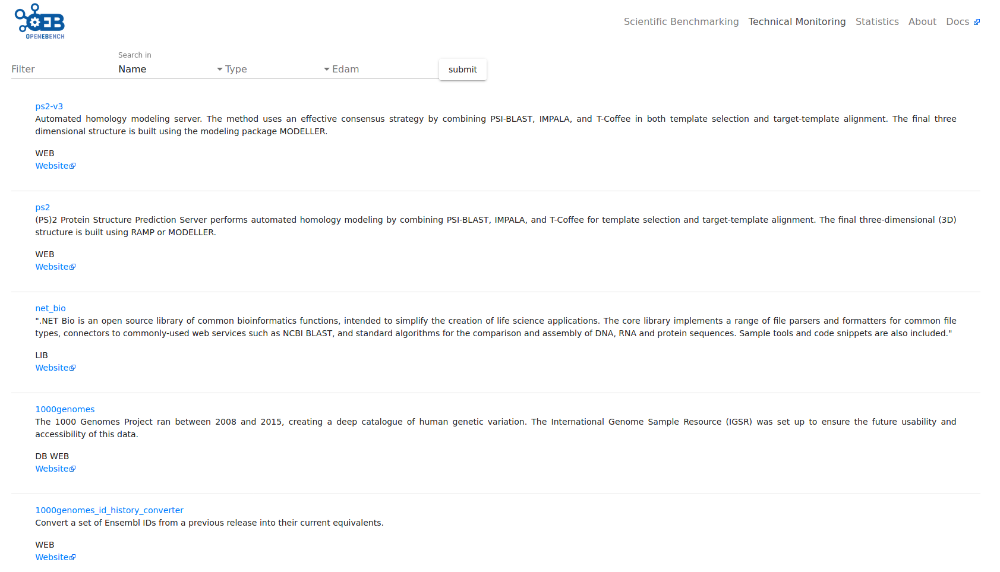
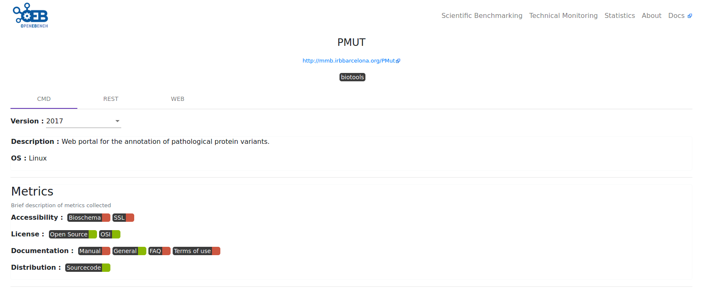
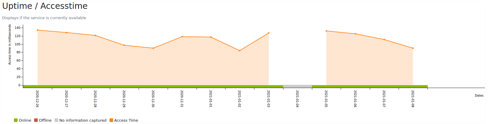
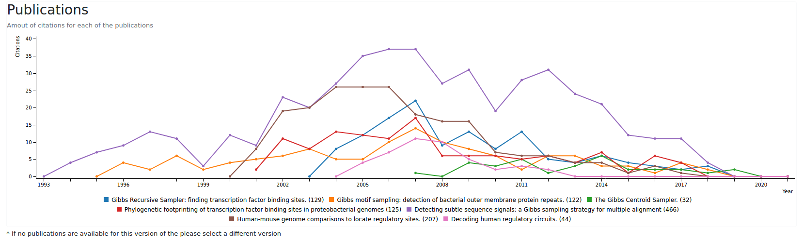
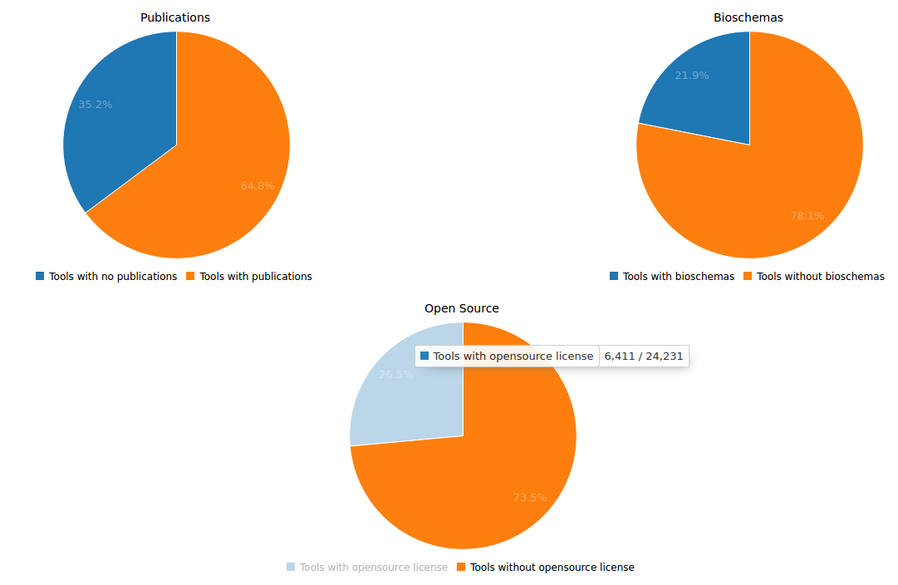
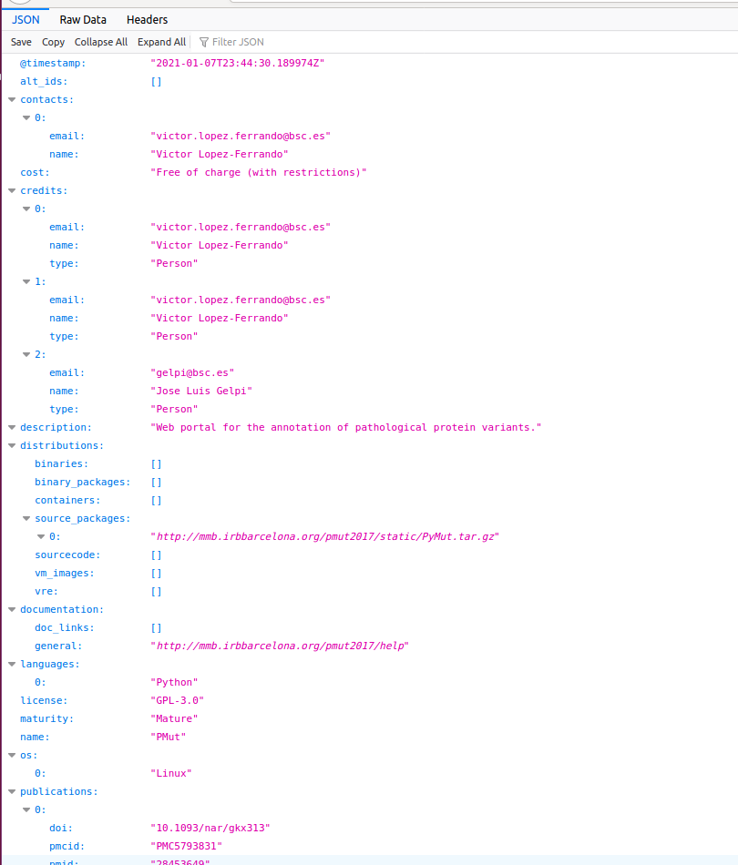

# Introduction to software monitoring in bioinformatics

Software quality is a key issue in research, as the quality of scientific outcomes is clearly ligated to the quality of the tools used to deliver them. Bioinformatics as a whole has been largely accused of generating poor research software due to the prioritization of the quick results over the optimization and standardization of the tools used. This is not unexpected, as bioinformatics is a fast evolving field. Accepted algorithms become obsolete far before the software made out of them can reach the usual quality standards normal in other disciplines. While this is traditionally accepted as normal use by researchers, it puts strong questions in the reproducibility of research results and on the validity of processed data deposited in large archives like, for instance, the European Genome-Phenome archive.

OpenEBench, as indicated above, holds a specific infrastructure to [monitor software quality](https://openebench.bsc.es/tool). 

# Metrics

In this infrastructure we have put together a series of **quality metrics** taken from a number of sources. The source of such metrics includes documents by the Software Sustainability Institute, recommendations for open source software development, or for software quality. For each metric, a specific source of information have been chosen and the necessary interface implemented. 

The following table collects the actual metrics being monitored in the present version of OpenEBench. 

|          Metrics Name         |  Total | Percentage % |
|:-----------------------------:|:------:|:------------:|
|                               |**Tools Ids**|         |
|          Resource ID          | 15,002 |     100%     |
|                               |**Documentation** |    |
|          Description          | 14,850 |      99%     |
|              Help             |   670  |      5%      |
|             Manual            |  2,322 |      15%     |
|            Tutorial           |   222  |      2%      |
|          Publications         | 11,107 |      74%     |
|                       |**Identity & Findability**|    |
|            Website            | 15,002 |     100%     |
|           bioschemas          |   455  |      3%      |
|                 |**Buildability & Installability**|   |
|            Language           |  5,232 |      35%     |
|        Operating system       |  5,758 |      38%     |
|                               |**Copyright**|         |
|      Copyright statement      |   479  |      3%      |
|            Credits            |  2,089 |      14%     |
|                               |**Licensing**|         |
|        Project license        |  5,411 |      36%     |
|          Open source          |  2,801 |      19%     |
|              OSI              |  2,724 |      18%     |
|                               |**Accessibility**|     |
|      Binary distribution      |  4,346 |      29%     |
|          Source code          |  4,639 |      30%     |
|    Source code repositories   |   586  |      4%      |
|               |**Supportability & User Support** |    |
|             e-mail            |  8,138 |      54%     |
|                               |**Changeability**|     |
|         Issues tracker        |   17   |      <1%     |

The main source of information for this data corresponds to ELIXIR-EXCELERATE WP1’s [bio.tools](https://bio.tools/) registry, but primary data is also collected from [BioConda](https://bioconda.github.io/) repository and [Galaxy Tool-Shed](https://toolshed.g2.bx.psu.edu/). Additionally, OpenEBench uses information available, mainly publications and URLs to perform additional analyses from publications archives like [Europe PMC](https://europepmc.org/), [NCBI PubMed](https://www.ncbi.nlm.nih.gov/pubmed/), and [WikiData](https://www.wikidata.org/wiki/Wikidata:Main_Page). Software repositories API’s (mainly [GitHub](https://github.com/)) is the source for buildability metrics, software dependencies, available releases and project contributors Websites (from the available URLs) are parsed for [BioSchemas](http://bioschemas.org/) markup, and also analyzed using text-mining strategies to derive additional information, in particular regarding documentation. In addition to the retrieval of static data from the repositories or associated documentation, URLs are actively tested in a daily basis in terms of availability and response time. This is, naturally, of prime importance, in the case of on-line tools, although also software repositories are checked for changes in their availability.

The OpenEBench repository aims to offer the users with clear view of the usability of the tools under study. It complements the information available in other registries, by keeping record of the different deployment options (Command line, software packages, Galaxy instances, web portal), and also of the versions of the software available in real time. 
The present contents of OpenEBench Tools monitoring repository contains 15,002 tools corresponding to over 22,000 deployments, all of them actively checked, so this numbers are constantly changing. Other metrics are less encouraging, although almost all show a clear description of the tools: only 2,800 (19%) have an easily accessible documentation other then a simple description; 3,300 (23%) an open source licence or a terms of use document. This table shows a summary of the number of tools, servers and workflows imported from each of the available repositories.

|                           Repository                          | Imported Entries |
|:-------------------------------------------------------------:|:----------------:|
| ELIXIR Tools Registry bio.tools                               |      14,425      |
| bioconda/biocontainers                                        |       6,365      |
| Galaxy Shed                                                   |       1,494      |
| Total Entries (total entries after collapsing redundant ones) | 60,730  (22,284) |

# Web interface

The tools monitoring section allows to perform a complete search, including tools titles, description and type, and relevant annotations like EDAM’s operation and topic terms, as seen in the figure below.

The selection of a given tool gives access to the specific card (Figure below) where general information of the tools, their possible implementations and links to the sources of information are available.

In addition to the general metrics indicated in the [Metrics table](#metrics), OpenEBench Tool Card includes life information about the availability of the tool, as obtained from monitoring the relevant URLs. This check is done in a daily basis and includes, up/down state, time of response, and for encrypted (https) links the validity of the encryption setup. This image shows an example of such information:

Finally, an updated record of the citations received by the publications associated to the tool is provided in the tool entry. The procedure to obtain the list of citations is the next:

1. Fetch from OpenEBench the list of tools with bibliographic references (i.e. PubMed Ids, DOIs and/or PMC ids).
2. For each one of these bibliographic references, query several bibliographic sources for records about them. We are currently using [Europe PMC](https://europepmc.org/), [NCBI PubMed](https://www.ncbi.nlm.nih.gov/pubmed/), and [WikiData](https://www.wikidata.org/wiki/Wikidata:Main_Page), through their programmatic APIs, as bibliographic and citation providers. For each source, a correspondence from each bibliographic identifier and its internal id is obtained.
3. For those matched identifiers, additional details are recovered, like their title, augmented and curated set of bibliographic identifiers, year of publication and the list of authors. Also, with the unique internal ID, the list of internal identifiers of manuscript references and each known citation is obtained. Then, the details of each identifier in the reference and citation lists are fetched, in order to classify them by year.
4. After this, there is a consolidation phase for each tool’s bibliographic reference, where the gathered citations from all the sources are integrated, so only the unique citations are used for the statistics. The public, bibliographic identifiers of each citation are used for that.

The image below shows an example of the resulting plot.

Additionally, a complete set of statistics about the contents of the data warehouse are available through the statistics tabs:

**Technical monitoring widgets** 

OpenEBench captures and presents large amounts of data. Representation of such data as part of other infrastructures requires a condensed version that can be easily placed in their web layouts and provide a quick overview of the information available, albeit interested users can still link to the main OpenEBench site. 

As in the scientific benchmarking component, a number of HTML widgets have been designed and implemented for that purpose. The current widget gallery contains five widgets. These widgets are distributed as simple HTML snippets along with a Javascript file (that bundles opensource 3rd  party libraries) which can easily be integrated on any web application.

Examples of the widgets, as well as instructions on how to implement them, can be found here:
- [Uptime chart](https://github.com/inab/uptime-chart-OEB/blob/master/README.md)
- [Citations chart](https://github.com/inab/citations-widget-OEB/blob/master/README.md)

# RESTful API’s

| Data Retrieval APIs            |                     URL                        | Source code | 
|--------------------------------|------------------------------------------------|-------------|
| OpenEBench Tools Monitoring    | [endpoint](https://openebench.bsc.es/monitor/)                  | [https://gitlab.bsc.es/inb/elixir/tools-platform/elixibilitas](https://gitlab.bsc.es/inb/elixir/tools-platform/elixibilitas)        |
| OpenEBench Scientific REST API | [endpoint](https://openebench.bsc.es/api/scientific/access/)| [https://gitlab.bsc.es/inb/elixir/openebench/openebench-rest-api](https://gitlab.bsc.es/inb/elixir/openebench/openebench-submission-api)        |        
| OpenEBench Scientific Retrieve |  [endpoint](https://openebench.bsc.es/sciapi/ )                  | Inab repo        | 

Although OpenEBench website gives access to all information stored in the data warehouse in a friendly manner, the platform is designed to provide information in a way that can be integrated in other infrastructures. To this end a series of RESTful API’s have been developed . Information from these APIs is obtained in JSON format (see partial example on figure  below). 

It is relevant to note that information can be obtained for specific versions or specific deployments of the tool. This opens the possibility of performing historical analysis comparing the performance and/or availability of different resources versions. More information on  the API is available at https://gitlab.bsc.es/inb/elixir/tools-platform/elixibilitas.

# Coordination with other ELIXIR activities.

As mentioned earlier, OpenEBench aims to become an knowledge hub around the technical monitoring and scientific benchmarking of bioinformatics tools, servers and workflows. In such effort, it is important to being able to integrate data from diverse repositories, especially from the ELIXIR platforms, in order to derive most of the already mentioned quality metrics. At the time of writing this report, OpenEBench integrates tools, servers and workflows from four main repositories. Importantly, this integration is bidirectional, which will facilitate the later access to all metrics available at OpenEBench by those platforms. 

OpenEBench has incorporated the ELIXIR Authentication and Authorization Infrastructure (ELIXIR AAI) developed by the ELIXIR Compute Platform as part of the ELIXIR-EXCELERATE WP4 for offering to each user their own working space. This is especially relevant for those participants on the scientific benchmarking activities as they can fully control which data is submitted to each community and how that data is available in OpenEBench e.g. fully private, shared with the community members, shared via a URL, and/or public.

In coordination with the ELIXIR Interoperability platform, OpenEBench now monitors which tools websites implement [bioshemas](http://bioschemas.org/) for annotating their tools, servers and/or workflows. When bioschemas tags are detected, OpenEBench makes sure they are compliant accordingly to the implementation promoted by the Interoperability platform. It is being evaluated which additional information can be obtained using bioschemas for broadening the number of quality metrics under evaluation. 
